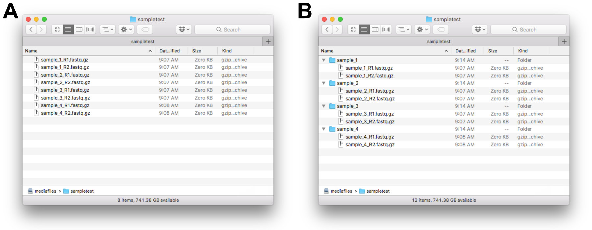

# snakemake_falco
A Snakemake pipeline to run **Falco** (https://github.com/smithlabcode/falco) on a set of fastq.gz files

**Citation:**

de Sena Brandine G and Smith AD. *Falco: high-speed FastQC emulation for quality control of sequencing data.* F1000Research 2021, 8:1874 (https://doi.org/10.12688/f1000research.21142.2)


## Workflow overview

Our samples are organized in folders. After being downloaded from the sequencing center, all *fastq.gz* files are in one subfolder for that particular run (the "library" folder, see Figure 1A).  Applying the `create_sample_subdirs.py` script leads to the correct file hierarchy, as shown in Figure 1B.

**This snakemake pipeline assumes a file hierarchy as shown in Figure 1B.**




**Figure 1:** File structure of our read libraries. **(A)** After initial download. **(B)** After applying the `create_sample_subdirs.py` script, samples are within their respective sub-folders.


## Preparation

The snakemake workflow runs Falco on all the samples listed in a file called  "samples.csv". (This file name can be specified in the config.yaml)

For our folder organization, this csv file can be created by doing the following:

```bash
# Create a quick list of files in the current folder, which contains
# sample subfolders:
ls > samplelist.txt
# Then, make sure only sample IDs are in the file by removing the 
# line for samplelist.txt and others that shouldn't be there

# Then create the sample.csv file:
$SCRIPTDIR=/change/to/whereever/the/script/folder/is
python $SCRIPTDIR/make_sample_csv.py samplelist.txt
```


Copy the sample.csv file into the *snakemake_falco* folder.


## Run snakemake

To test out the script, using 8 threads:

```bash
snakemake -j8 -p -n
```

The workflow creates symlinks to the original data locations within the *data/reads* sub-folder of *snakemake_falco*. This was easier to set up than trying to deal with various different base paths in the snakemake script. This way, all snakemake output goes to *data/reads/{sample/qcreports}*


If everything looks good, run it without the "-n" option:

```bash
snakemake -j8 -p
```


## Output

A folder named "*qcreports*" gets created in each original sample data folder. Within it, are two Falco html report files that can be opened in a web browser:

* {sample}_fastqc_report_R1.html_ for the forward reads
*  *{sample}_fastqc_report_R2.html* for the reverse complement reads.

